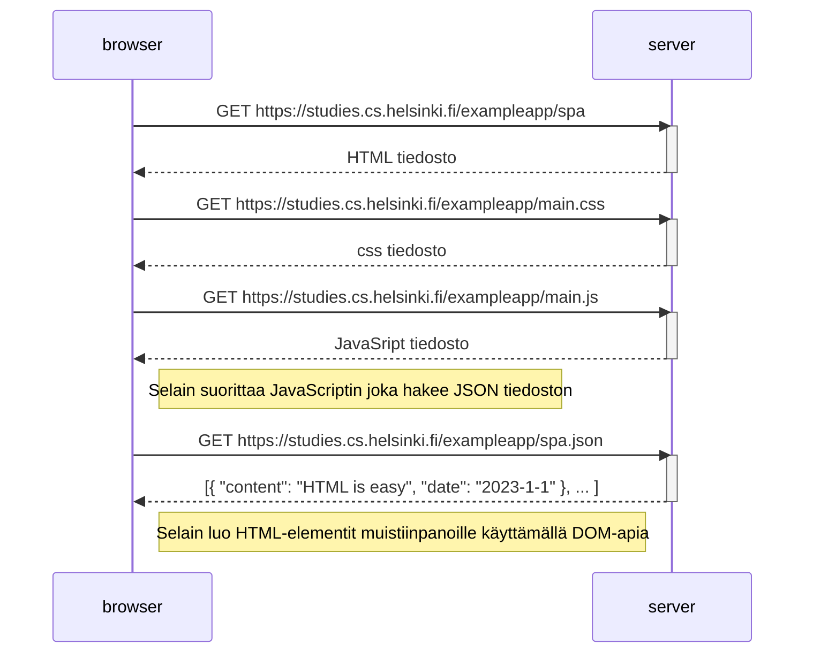

```mermaid
sequenceDiagram
    participant browser
    participant server
    
    browser->>server: GET https://studies.cs.helsinki.fi/exampleapp/spa
    activate server
    server-->>browser: HTML tiedosto
    deactivate server
    
    browser->>server: GET https://studies.cs.helsinki.fi/exampleapp/main.css
    activate server
    server-->>browser: css tiedosto
    deactivate server
    
    browser->>server: GET https://studies.cs.helsinki.fi/exampleapp/main.js
    activate server
    server-->>browser: JavaSript tiedosto
    deactivate server
    
    Note right of browser: Selain suorittaa JavaScriptin joka hakee JSON tiedoston
    
    browser->>server: GET https://studies.cs.helsinki.fi/exampleapp/spa.json
    activate server
    server-->>browser: [{ "content": "HTML is easy", "date": "2023-1-1" }, ... ]
    deactivate server    

    Note right of browser: Selain luo HTML-elementit muistiinpanoille käyttämällä DOM-apia
```