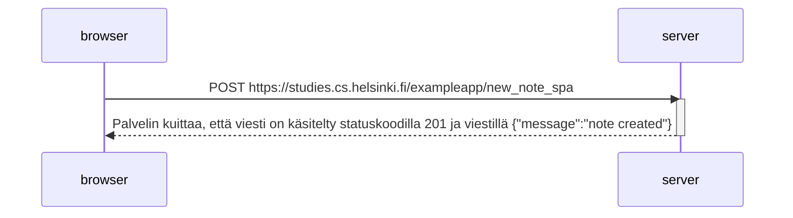

```mermaid
sequenceDiagram
    participant browser
    participant server
    
    browser->>server: POST https://studies.cs.helsinki.fi/exampleapp/new_note_spa
    activate server
    server-->>browser: Palvelin kuittaa, että viesti on käsitelty statuskoodilla 201 ja viestillä {"message":"note created"}
    deactivate server
```